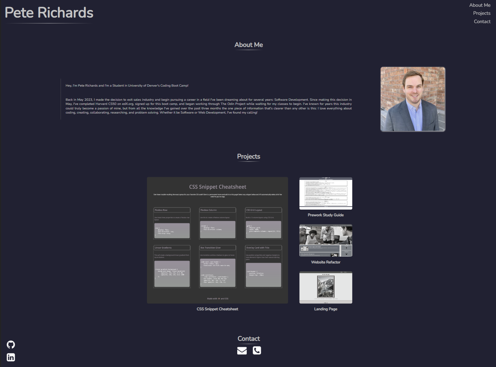

# Portfolio

## Description

The purpose of this portfolio is to provide information about me and to showcase the skills I've learned in the first week of University of Denver's Coding Boot Camp. The projects I've launched will be accessible via links to their respective repositories and live sites. Throughout the remainder of the boot camp I will add projects to this portfolio and update the overall design and interactivity with the new skills I gain along the way.

To see my portfolio click [here!](https://prich57.github.io/portfolio)

## Installation

N/A

## Usage

This page contains links and interactive elements that can take you to specific information, projects, or contact information.

The navigation (nav) bar in the top right of the screen on a desktop viewport and fixed to the top of the page on a mobile device has three elements that, when clicked, will take the user to the correlating locations on this web app. For example, when the user clicks, or touches with their finger on a mobile device, the word "Projects" in the nav bar, they will be taken directly to the "Projects" section of this page. The same process works with the other two elements within the nav bar.

This web app also contains clickable icons that will link the user to various methods of contacting me or to my profiles on GitHub and LinkedIn. The GitHub and LinkedIn icons will remain in the bottom left hand corner of the viewport regardless of the device being used to view my portfolio or the users location on the page. On desktop, if the user hovers their mouse over these icons, or the two icons at the bottom of the page in the "Contact" section, they'll see a tooltip with information about what these icons do when clicked. The tooltips for the mail and phone icons contain my email and phone number respectively. When the user clicks the mail icon it will automatically open up an email from the user's preferred email application and my email address will automatically be filled in as the recipient. If the phone icon is clicked it will open up an sms message with my phone number as the recipient. This phone icon has more use for a mobile device with sms capabilities, but the tooltip provides my phone number for desktop users to reference when attempting to call or text me.

The "Projects" section of the page contains images of my projects and, when clicked, they'll open a new tab in the user's browser with the live site for the selected project. Each image has a grayscale filter that will be removed upon hovering over an image with the user's mouse. There will also be additional style elements applied to make the image stand out when hovering over it. For mobile users, the grayscale filter has been removed automatically when the viewport size is smaller than that of a desktop.

The layout and design of this web app will adjust automatically according to the device and viewport size to maximize the user's comfort and experience.

## Mock-Up

The following image shows the portfolio's appearance and functionality.

## Credits

Contact icons source: https://github.com/Rush/Font-Awesome-SVG-PNG

## License

TBD
